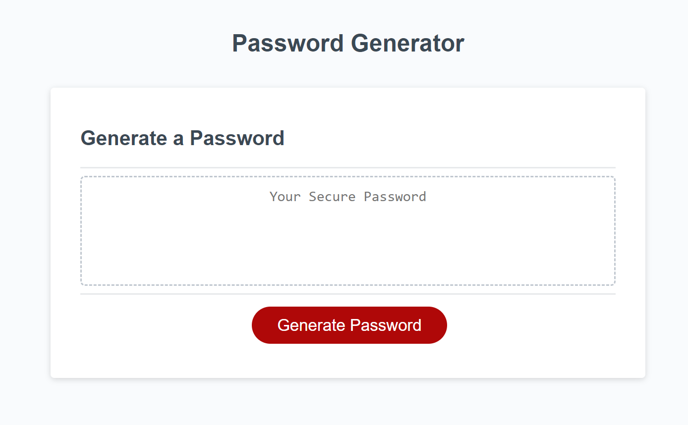

# Password-Generator

## Description

This project is tasked with creating an app that runs in the browser and features dynamically updated HTML and CSS, all powered by JavaScript code. The app have a clean and polished user interface that is responsive, ensuring that it adapts to multiple screen sizes.

The application is created to satisfy the folloing conditions:

-  Generate a password when the button is clicked.

-  Present a series of prompts for password criteria:

   -  Length of password:

   -  At least 8 characters but no more than 128.

   -  Character types:

   -  Lowercase

   -  Uppercase

   -  Numeric

   -  Special characters ($@%&\*, etc.)

-  Code should validate for each input and at least one character type should be selected.

-  Once all prompts are answered, the password should be generated and displayed in an alert or written to the page.

Home Page of the Password Generator App.

## Credits

The following articles and websites are used as references for this particular project.

[Professional README Guide](https://coding-boot-camp.github.io/full-stack/github/professional-readme-guide)

[JavaScript Arrays](https://developer.mozilla.org/en-US/docs/Web/JavaScript/Reference/Global_Objects/Array)

[JavaScript Objects](https://developer.mozilla.org/en-US/docs/Web/JavaScript/Reference/Global_Objects/Object)

## Deployment Page Link

[Password Generator](https://anjalsali.github.io/Password-Generator/)
